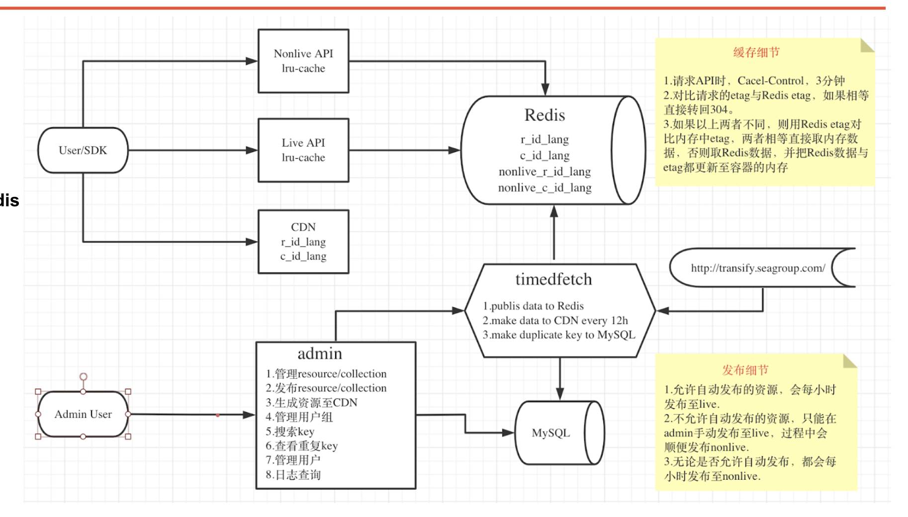

## 1.背景

目前翻译拉取触发时机有三处，一是部署时自动拉取（保证部署时使用的是最新的翻译，失败后不会终止）；二是人为本地使用命令拉取，然后提交；三是git commit 的时候触发git hook拉取。以下是commit时触发拉取的流程

自动拉取有以下不便：

1. 使用--no-verify参数绕过太麻烦，而且日后还可能会有其他校验，不适合绕过
2. 不使用的话就会自动拉取，有时候做一点改动，因为翻译文件更新了还会导致冲突。为了保持分支干净，又要重新拉分支解决冲突。就算翻译没更新，commit的时候断网还会失败

## 2.解决方案

### 2.1 不追踪

因为部署的时候会自动拉取，所以干脆不追踪翻译文件，拉取翻译的部署任务改为`ignore_errors: false`，确保有翻译。风险是万一翻译平台挂了，就无法部署。

### 2.2 合并策略，使用.gitattributes或者git merge -X ours

+ git 提供控制特定文件合并策略的配置——`.gitattributes`，利用`.gitattributes`可以把翻译文件的合并策略改为总是使用当前的。这样就不会有冲突，但是该方案需要设置git 全局配置` git config --global merge.ours.driver true`。但gitlab 中暂时不支持该功能。[issure地址](https://gitlab.com/gitlab-org/gitlab/-/issues/18830)
+ merge的时候使用-X参数吧合并策略变成使用ours的，但是这个命令不能区分路径，这样会把业务代码也给覆盖掉。而且暂时不知gitlab是否支持

### 2.3 sub-module

可以单独给翻译文件新开一个子git项目。这样既能解决冲突的问题，又能追踪翻译文件。使用该方案需要对现有项目进行以下改动：

1. 使用`husky`，在git 的`post-merge`钩子触发阶段（merge成功后触发）执行`git submodule update --init --remote --merge -- i18n `。确保每次git pull都能获取翻译内容

2. 更改`pre-commit`钩子的处理逻辑，确保更新子项目内容。大体上就是从`npm run translate && git add .`改为

   1. cd ./i18n
   2. git checkout master
   3. npm run translate
   4. git fetch origin master && git merge -X ours
   5. git add . && git commit -m 'refactor: update' && git push

为了防止主项目分支合并时submodule id的冲突，因此子项目更新后，主项目不更新submodule id（设置`.gitmodules`的`ignore`为`all`）。并且无论成功失败，钩子的exit code都为0。即翻译文件的提交不影响主项目的正常commit

### 2.4 gitlab ci

可以通过`gitlab`的配置文件`gitlab-ci.yml`，在mr合并前阶段进行。假设a分支合并b分支。

1. b分支ci触发，在容器中使用`git checkout origin/a -- i18n`把a分支的翻译获取并覆盖b分支
2. 使用commit api 提交一个commit

这样b分支的翻译内容跟a分支完全一致，就不会有冲突了。

### 2.5 tsg平台

[平台地址](https://tsp.i.seller.shopee.io/guide/general)
[平台介绍ppt](https://docs.google.com/presentation/d/17zG0Bp_VrhV6xTUzj4oZzMYmNwdbAX_q/edit#slide=id.gd0d83bca59_0_151)
使用接口的方式获取翻译文件，这样就没冲突的问题。而且还有以下主要优点如下：

1. tsg平台的接口也是优先从翻译平台拉取，如果翻译平台失败，就从cdn上获取之前的资源。稳定
2. 接口本身本身也有强缓存，只要资源不变，哈希不变，就能一直用缓存。
3. tsg平台可以自动/手动更新资源，这样就不用重新打包部署也能更新
4. tsg平台搭配了谷歌插件，可以直接在页面查看翻译key，这样pm可以直接获取key，不需要开发查代码。原理是代理请求，把请求返回设为空
5. tsg平台有集合的概念，可以自定义搭配key，只获取某些key。相当于懒加载。
6. 支持rn，有rn版的sdk
7. 平台还有其他辅助功能，如检查没翻译的key等
